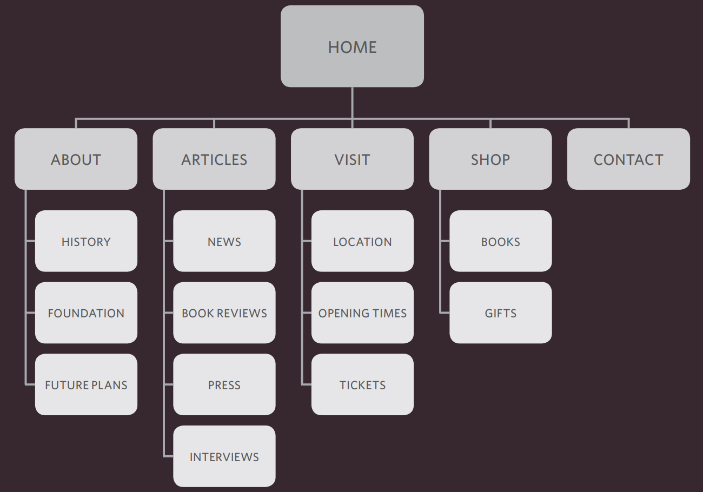

# Read: 03 - Structure web pages with HTML

Every website should be designed for the target, so we must understand the audience we target to do this we should answer the 4-W questions:
### WHO?
who your target audience is Individuals or Companies?
You should understand them and know them well by asking about:
Age, women or men, where they live, average income, Occupation, education, etc.

### WHY?
Why will people visit your site?
Find the answer by:
1.  Discover the motivations for why they will come to the site.
2. Examines the specific goals of the visitors.

### What?
What information your visitors need to achieve?
Find what they need to achieve looking at each of the reasons why people will be visiting your site. Cause you provide the information that your visitors are looking for, they will consider your site more relevant to them. however, they are likely to go elsewhere. If the site doesn’t answer their needs.

### How?
How often People Will visit your site? 
Some sites benefit from being updated more frequently than others, it is helpful to set a schedule for when a site will be updated.
 
After answering the 4-W questions now you are ready to make ** site map ** which is a diagram of the pages that will be used to structure the site also used to show how those pages can be grouped. After that use a technique called **card sorting** to decide what information should go on each page. 

Also sketch for the key information that needs to go on each page of a Site which called **Wireframes** It shows the hierarchy of the information and how much space it might require and organize the information.

***
## HTML
HTML pages are text documents uses tags which are referred to as elements and usually come in pairs. The opening tag denotes the start of a piece of content; the closing tag denotes the end, opening tags can carry attributes, which tell us more about the content of that element, Attributes require a name and a value.

The new HTML5 elements indicate the purpose of different parts of a web page and help to describe its structure. The new elements provide clearer code. older browsers that do not understand HTML5.

`<!DOCTYPES>` tell browsers which version of HTML you are using. add comments to your code by place it between the
`<!--` and `-->` markers. Some elements will always appear to start on a new line in the browser window. These are known as block level elements Some elements will always appear to continue on the same line as their neighbouring elements. These are known as inline elements `<a>`, `<b>`, `<em>`, and ``. The `
` and `` elements allow you to group block-level and inline elements together.
`<iframes>` cut windows into your web pages through which other pages can be displayed.

The `<meta>` element is tag inside the `<head>` which allows you to supply all kinds of information about your web page.

Escape characters are used to include special characters in your pages such as <, >, and ©.

***

Go back

[Back](README.md)