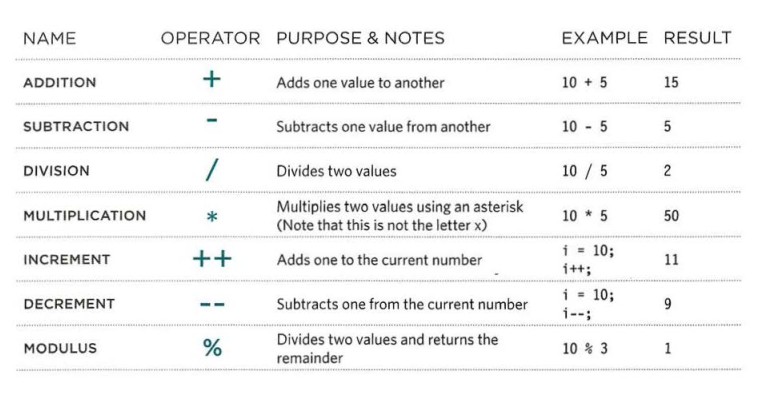
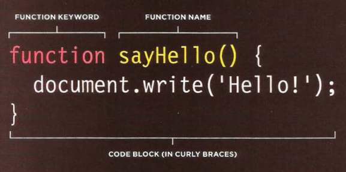

# Read: 04 - Programming with JavaScript

# JavaScript
JavaScript makes web pages more interactive by accessing (select any element, attribute, or text from an HTML page) and modifying (add elements, attributes, and text to the page, or remove them) the content and markup used in a web page while it is being viewed in the browser.
<br><br>

## A script
* a script is a series of short instructions, each of which is performed in order to solve the problem in hand.
* A Script is made up of instructions a computer can follow step-by-step.
* A browser may use different parts of the script depending on how the user interface with the web page.
* Script can run different sections of the code in response to the situation around them.

<br>

### Creating A script:
creating a script is like writing a recipe or manual that allows a computer to solve a puzzle one step at a time.
To write a script, you need to first
state your goal **(DEFINE THE GOAL)**, I mean Start with the big picture of what you want to achieve, and break that down into smaller steps **(DESIGN THE SCRIPT)**, This can be represented using a flowchart.


After you define the goal and design the script now you can begin coding **(CODE EACH STEP)**, you need to get to grips with the:

* Vocabulary: The words that computers understand
* Syntax: How you put those words together to create instructions computers can follow.

## Expression
An expression evaluates into a single value. Broadly speaking there are two types of expressions. 

1. EXPRESSIONS THAT JUST ASSIGN A VALUE TO A VARIABLE

` var color = 'beige'; `

2. EXPRESSIONS THAT USE TWO OR MORE VALUES TO RETURN A SINGLE VALUE

` var area = 3 * 2; `

## OPERATORS

They allow programmers to create a single value from one or more values. ASSIGNMENT OPERATORS
` color = 'beige';`

## ARITHMETIC OPERATORS



```var subtotal (13 + 1) * 5;  // Subtotal is 70
var shipping 0.5 * (13 + 1) ; // Shipping i s 7
var total subtotal + shipping ; II Total is 77
var el Sub document .getElementByid(' subtotal ') ;
elSub .textContent =subtotal ;
var elShip = document .getElement Byid('shi ppi ng ') ;
elShip.textContent =shipping;
var elTotal = document .getElementByid('total ');
elTotal.textContent =total;
```


## STRING OPERATORS

`var firstName = 'Ivy';`
`greeting = 'Hi’ + 'Molly';`


## COMPARISON OPERATORS
` buy = 3 > 5;`


## LOGICAL OPERATORS
` buy= (5 > 3) && (2 < 4);`


## FUNCTIONS
Functions let you group a series of statements together to perform a
specific task. If different parts of a script repeat the same task, you can
reuse the function (rather than repeating the same set of statements)

```javascript
var msg = 'Sign up to receive our newsletter for 10% off!';
function updateMessage() {
var el = document.getElementByld('message'};
el .textContent = msg;
}
updateMessage(};
```

* ### Declaring a function:
To declare function type `function` (key word) then the name of the function as follow:



If the function needs information (parameters) to perform the task put them inside the parentheses as follow:


```javascript
function calculateArea(width, hight){
    var area = width * height;
    return area;
}
```

* ### Calling a function:
Just type the `function-name( )`, as follow:

`sayHello()`

If the calling function needs information, we must specify the values in the parentheses, as follow:

`var wall-one = calculateArea(4, 5);`


Getting single value out of a function:
We use `return` (key word) to return value for the code we called the function from.
