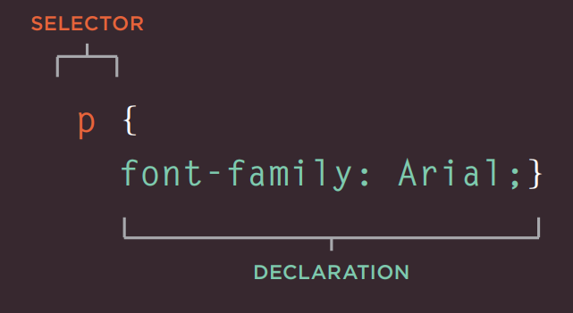
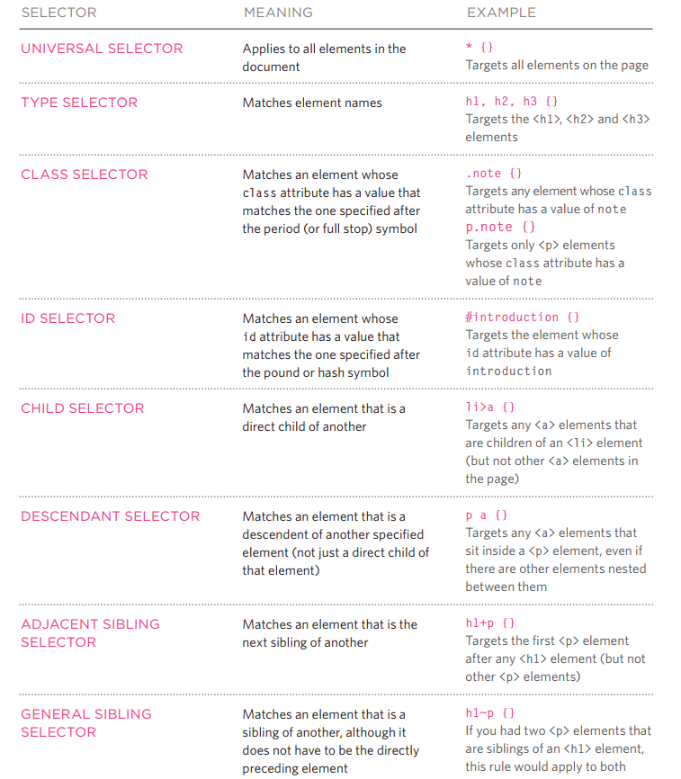
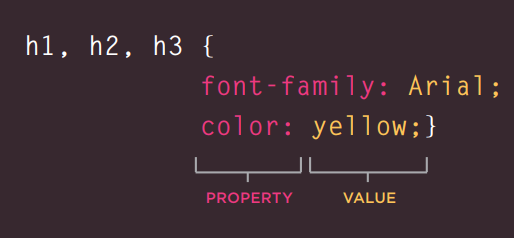

# Read: 06b - Design web pages with CSS

# CSS
* CSS1 was released in 1996 and CSS2 followed two years later. Work on CSS3 has been ongoing but the major browsers have already started to implement it.
* CSS works by associating rules with HTML elements by insert the `<link>` element as `<link rel="stylesheet" href="assets/css/style.css">` (External style sheet), there are several advantages to placing your CSS rules in a separate style sheet.
* You can also include CSS rules within an HTML page by placing them inside a `<style>` element, which usually sits inside the `<head>` element of the page (internal style sheet).
* An HTML page can use more than one CSS style sheet.
CSS treats each HTML element as if it appears inside its own box and uses rules to indicate how that element should look.
* The rules govern how the content of specified elements should be displayed. 
* CSS rule contains two parts selector & declaration. 

* There are many different types of CSS selector that allow you to target rules to specific elements in an HTML document. Different types of selectors allow you to target your rules at different elements.

* You can add `!important` after any property value to indicate that it should be considered more important than other rules that apply to the same element

* CSS declarations sit inside curly brackets and each is made up of two parts: a property and a value, separated by a colon.

