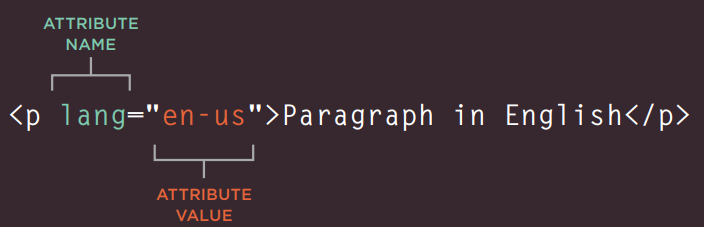
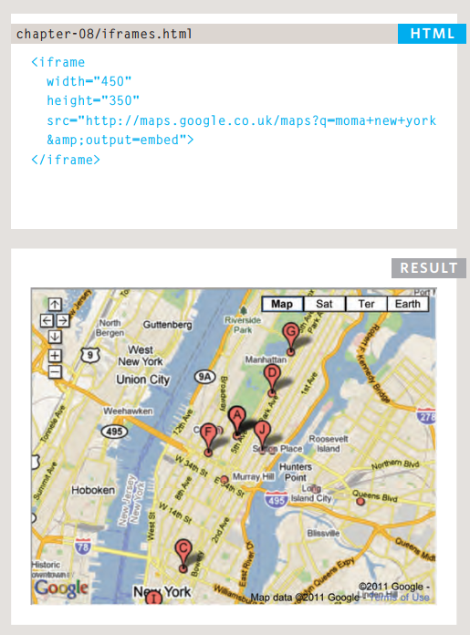
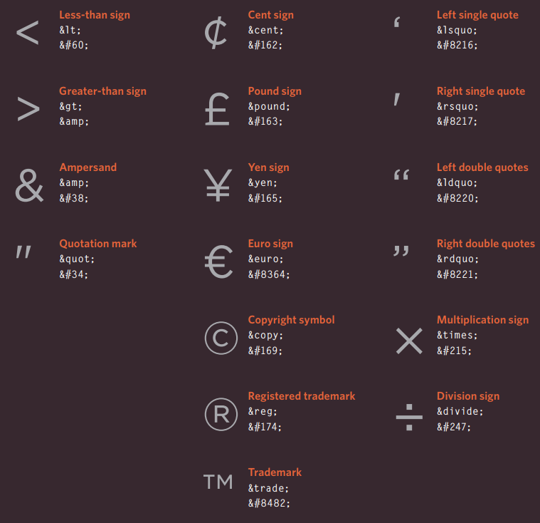
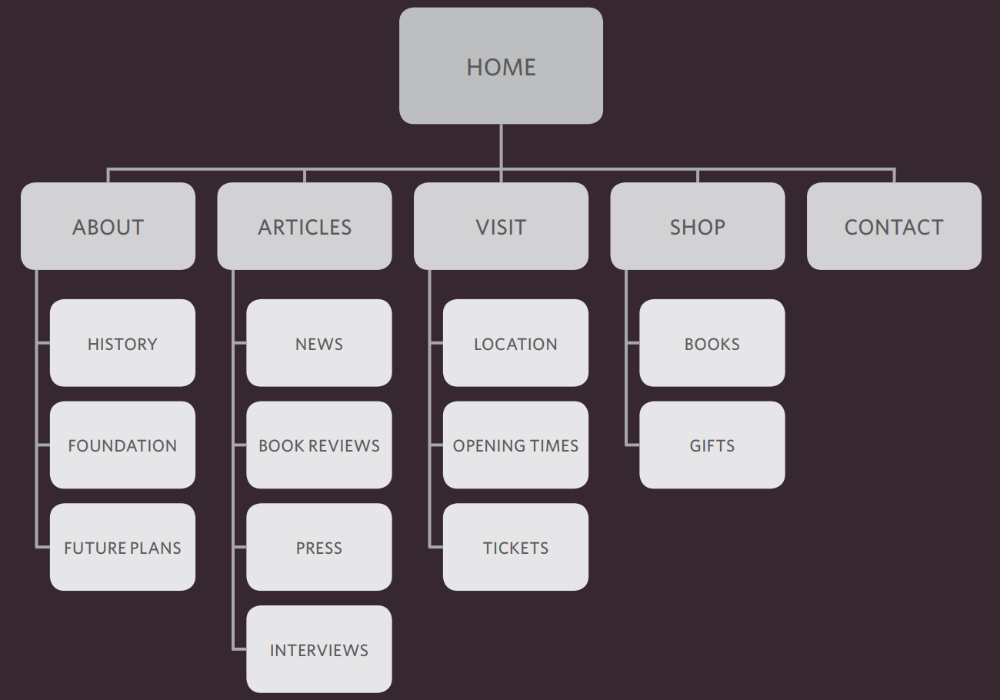
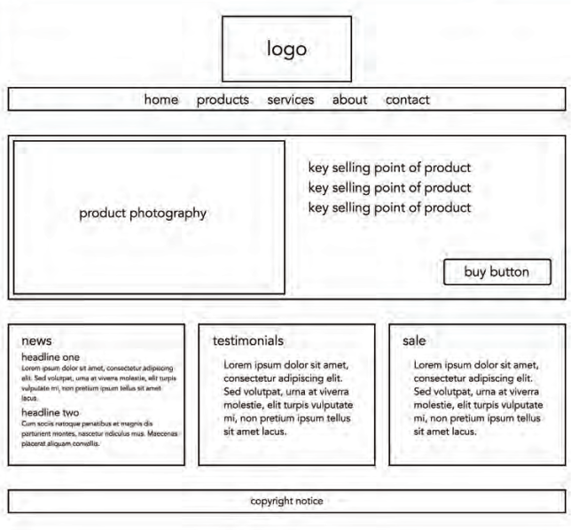

# Read: 01 - Introductory HTML and JavaScript

## How People access the web?
There are different ways can people use to access the web:
1. Browsers: Firefox, Internet Explorer, Safari, Chrome, and Opera, etc.
2. Web servers: special computer which hosts the website, they are constantly connected to the Internet, and are optimized to send web pages out to people who request them.
3. screen readers: programs that read out the contents of a computer screen to people with visual impairments.
4. devices: desktop computers, laptops, tablets, and mobile phones.
## How are Websites created?
* All websites use HTML and CSS.
* Most web pages also include extra content such as images, audio, video, or animations.
* Small websites are often written just using HTML and CSS.
* Larger websites often make use of more complex technologies on the web server, but these technologies are used to produce HTML and CSS that is then sent to the browser. Larger, more complex sites and may use a database to store data, and programming languages such as PHP, ASP.Net, Java, or Ruby on the web server.
* Some sites also send JavaScript or Flash to your browser.

## HTML
HTML pages are text documents uses tags which are referred to as elements and usually come in pairs. The opening tag denotes the start of a piece of content; the closing tag denotes the end, opening tags can carry attributes, which tell us more about the content of that element, Attributes require a name and a value.



The new HTML5 elements indicate the purpose of different parts of a web page and help to describe its structure. The new elements provide clearer code. older browsers that do not understand HTML5.

`<!DOCTYPES>` tell browsers which version of HTML you are using. 

The `<body>` element in the first example we created. Everything inside this element is shown inside the main browser window.

The `<head>` element contains information about the page, information that is shown within the main part of the browser window that is highlighted in blue on the opposite page. 

The `<title>` element are either shown in the top of the browser, above where you usually type in the URL of the page you want to visit, or on the tab for that page, you will usually find a `<title>` element inside the `<head>` element.

We add comments to our code by place it between the `<!--` and `-->` markers. 

*ID attribute:* It is used to uniquely identify that element from other elements on the page. Its value should start with a letter or an underscore (not a number or any other character). It is important that no two elements on the same page have the same value for their id attributes.

```html
<p id="pullquote">Every time I view the sea, I feel a calming sense of security, as if visiting my ancestral home; I embark on a voyage of seeing.
</p>
```
*CLASS attribute:*It is used to uniquely identifying one element within a document, you will want a way to identify several elements as being different from the other elements on the page.

```html
<p class="important">For a one-year period from November 2010, the Marugame Genichiro-Inokuma Museum of Contemporary Art (MIMOCA) will host a cycle of four Hiroshi Sugimoto exhibitions. </p>
<p>Each will showcase works by the artist thematically contextualized under the headings "Science," "Architecture," "History" and "Religion" to present a comprehensive panorama of the artist's oeuvre. </p>
<p class="important admittance">Hours: 10:00 – 18:00 (No admittance after 17:30) </p>
```

## What are the Block level and Inline level elements,and what the difference between them?
Some elements will always appear to start on a new line in the browser window. These are known as block level elements. The `<div>`, `<span>`, `<h1>`,` <p>`,` <ul>`, and `<li>`elements allow you to group block-level and inline elements together.


Some elements will always appear to continue on the same line as their neighbouring elements. These are known as inline elements `<a>`, `<b>`, `<em>`, and ``. 


### Grouping text & elements in a block
The `<div>` element allows you to group a set of elements together in one block-level box. It can also make it easier to follow your code if you have used `<div>` elements to hold each section of the page.

```html
<div id="header">

<ul>
<li><a href="index.html">Home</a></li>
<li><a href="biography.html">Biography</a></li>
<li><a href="works.html">Works</a></li>
<li><a href="contact.html">Contact</a></li>
</ul>
</div><!-- end of header -->
```


### Grouping text & elements inline
The <span> element acts like an inline equivalent of the `<div>` element. 
It is used to either: Contain a section of text where there is no other suitable
element to differentiate it from its surrounding text, Contain a number of inline
elements.
The most common reason why people use `<span>` elements is so that they can control the appearance of the content of these elements using CSS.

```html
<p>Anish Kapoor won the Turner Prize in 1991 and exhibited at the <span class="gallery">Tate Modern</span> gallery in London in 2003.</p>
```

## Iframes
An iframe is like a little window that has been cut into your page — and in that window you can see another page. The term iframe is an abbreviation of inline frame.





## information about your pages
The `<meta>` element is tag inside the `<head>` which allows you to supply all kinds of information about your web page.

```html
<!DOCTYPE html>
<html>
<head>
<title>Information About Your Pages</title>
<meta name="description"
    content="An Essay on Installation Art" />
<meta name="keywords"
    content="installation, art, opinion" />
<meta name="robots"
    content="nofollow" />
<meta http-equiv="author"
    content="Jon Duckett" />
<meta http-equiv="pragma"
    content="no-cache" />
<meta http-equiv="expires"
    content="Fri, 04 Apr 2014 23:59:59 GMT" />
</head>
<body>
</body>
</html>
```

## Escape characters
Escape characters are used to include special characters in your pages such as <, >, and ©.




## New HTML5 Layout eLements
HTML5 introduces a new set of elements that allow you to divide up the parts of a page. The names of these elements indicate the kind of content you will find in them. They are still subject to change, but that has not stopped many web page authors using them already.

### The `<header>` and `<footer>`
The `<header>` and `<footer>` elements can be used for: The main header or footer that appears at the top or bottom of every page on the site. A header or footer for an individual `<article>` or `<section>` within the page

### The `<nav>` element 
The `<nav>` element is used to
contain the major navigational
blocks on the site such as the
primary site navigation

```html
<nav>
    <ul>
        <li><a href="" class="current">home</a></li>
        <li><a href="">classes</a></li>
        <li><a href="">catering</a></li>
        <li><a href="">about</a></li>
        <li><a href="">contact</a></li>
    </ul>
</nav>
```
### The `<article>` element
The `<article>` element acts as a container for any section of a page that could stand alone and potentially be syndicated. This could be an individual article or blog entry, a comment or forum post, or any other ndependent piece of content.

```html
<article>
    <figure>
        
        <figcaption>Bok Choi</figcaption>
    </figure>
    <hgroup>
        <h2>Japanese Vegetarian</h2>
        <h3>Five week course in London</h3>
    </hgroup>
    <p>A five week introduction to traditional Japanese vegetarian meals, teaching you a selection of rice and noodle dishes.</p>
</article>
```

### The `<aside>` element
The `<aside>` element has two purposes, depending on whether it is inside an `<article>`element or not.
When the `<aside>` element is used inside an `<article>` element, it should contain information that is related to the article. but when the `<aside>` element is used outside of an `<article>` element, it acts as a container for content that is related to the entire page. 

### The `<section>` element
The `<section>` element groups related content together, and typically each section would have its own heading.

```html
<aside>
    <section class="popular-recipes">
        <h2>Popular Recipes</h2>
        <a href="">Yakitori (grilled chicken)</a>
        <a href="">Tsukune (minced chicken patties)</a>
        <a href="">Okonomiyaki (savory pancakes)</a>
        <a href="">Mizutaki (chicken stew)</a>
    </section>
    <section class="contact-details">
        <h2>Contact</h2>
        <p>Yoko's Kitchen<br />
        27 Redchurch Street<br />
        Shoreditch<br />
        London E2 7DP</p>
    </section>
</aside>
```
### The `<hgroup>` element
The purpose of the `<hgroup>` element is to group together a set of one or more `<h1>` through `<h6>` elements so that they are treated as one single heading

```html
<hgroup>
    <h2>Japanese Vegetarian</h2>
    <h3>Five week course in London</h3>
</hgroup>
```

### The <figure> <figcaption> elements

The `<figure>` element should contain a `<figcaption>` element which provides a text decription for the content of the `<figure>` element.

```html
<figure>
    
    <figcaption>Bok Choi</figcaption>
</figure>
```

## Process & Design
Every website should be designed for the target, so we must understand the audience we target to do this we should answer the 4-W questions:
### WHO?
who your target audience is Individuals or Companies?
You should understand them and know them well by asking about:
Age, women or men, where they live, average income, Occupation, education, etc.

### WHY?
Why will people visit your site?
Find the answer by:
1.  Discover the motivations for why they will come to the site.
2. Examines the specific goals of the visitors.

### What?
What information your visitors need to achieve?
Find what they need to achieve looking at each of the reasons why people will be visiting your site. Cause you provide the information that your visitors are looking for, they will consider your site more relevant to them. however, they are likely to go elsewhere. If the site doesn’t answer their needs.

### How?
How often People Will visit your site? 
Some sites benefit from being updated more frequently than others, it is helpful to set a schedule for when a site will be updated.
<br>
After answering the 4-W questions now you are ready to make ** site map ** which is a diagram of the pages that will be used to structure the site also used to show how those pages can be grouped. After that use a technique called **card sorting** to decide what information should go on each page. 



Also sketch for the key information that needs to go on each page of a Site which called **Wireframes** It shows the hierarchy of the information and how much space it might require and organize the information.



### visual hierarchy
refers to the order in which your eyes perceive what they see. It is created by adding visual contrast between the items being displayed. Items with higher contrast are recognized and processed first.  Visual hierarchy helps visitors understand what you are trying to tell them.


# JavaScript
JavaScript makes web pages more interactive by accessing (select any element, attribute, or text from an HTML page) and modifying (add elements, attributes, and text to the page, or remove them) the content and markup used in a web page while it is being viewed in the browser.
<br><br>

## A script
* a script is a series of short instructions, each of which is performed in order to solve the problem in hand.
* A Script is made up of instructions a computer can follow step-by-step.
* A browser may use different parts of the script depending on how the user interface with the web page.
* Script can run different sections of the code in response to the situation around them.

<br>

### Creating A script:
creating a script is like writing a recipe or manual that allows a computer to solve a puzzle one step at a time.
To write a script, you need to first
state your goal **(DEFINE THE GOAL)**, I mean Start with the big picture of what you want to achieve, and break that down into smaller steps **(DESIGN THE SCRIPT)**, This can be represented using a flowchart.


After you define the goal and design the script now you can begin coding **(CODE EACH STEP)**, you need to get to grips with the:

* Vocabulary: The words that computers understand
* Syntax: How you put those words together to create instructions computers can follow.


***

Go back

[Back](README.md)

