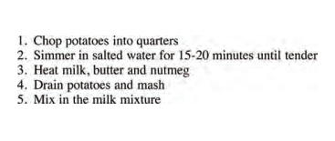
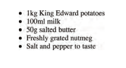
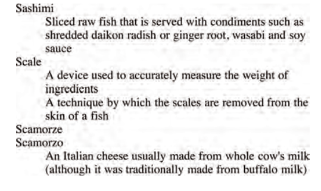
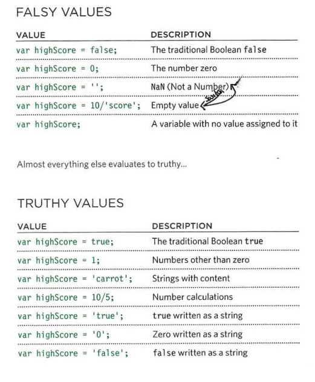

# Read: 03 - HTML Lists, CSS Boxes, JS Control Flow

## HTML lists:
1.	Ordered lists: each item in the list is numbered.
```html
<ol>
    <li>Chop potatoes into quarters</li>
    <li>Simmer in salted water for 15-20 minutes until tender</li>
    <li>Heat milk, butter and nutmeg</li>
    <li>Drain potatoes and mash</li>
    <li>Mix in the milk mixture</li>
</ol>
```


2.	Unordered lists: each item in the list begins with a bullet point.

 ```html
<ul>
    <li>1kg King Edward potatoes</li>
    <li>100ml milk</li>
    <li>50g salted butter</li>
    <li>Freshly grated nutmeg</li>
    <li>Salt and pepper to taste</li>
</ul>
```


3.	Definition lists: made up of a set of terms along with the definitions for each of those terms. it is created with the `<dl>` element, Inside the `<dl>` element you will usually see pairs of `<dt>` and `<dd>` elements. `<dt>` used to contain the definition term. `<dd>` used to contain the definition.

```html
<dl>
    <dt>Sashimi</dt>
        <dd>Sliced raw fish that is served with condiments such as shredded daikon radish or ginger root, wasabi and soy sauce</dd>
    <dt>Scale</dt>
        <dd>A device used to accurately measure the weight of ingredients</dd>
        <dd>A technique by which the scales are removed from the skin of a fish</dd>
    <dt>Scamorze</dt>
    <dt>Scamorzo</dt>
        <dd>An Italian cheese usually made from whole cow's milk (although it was traditionally made from buffalo milk)</dd>
</dl>
```

***




* You can put a second list inside an `<li>` element to create a sublist or nested list.


##  Boxes
* CSS treats each HTML element as if it lives in its own box.
* By default a box is sized just big enough to hold its contents. To change the dimensions for a box you can use the height and width properties.
* The popular ways to specify the size of a box are: pixels, ems (the size of the box is based on the size of text within it), or percentages (size of the box is relative to the size of the browser window or the parent box.

### overfloWing content
It tells the browser what to do if the content contained within a box is larger than the box itself. It can be *hidden* OR *scroll*.

### border-style
can be the following values:
* *solid* a single solid line
* *dotted* a series of square dots
* *dashed* a series of short lines
* *double two solid lines* 
* *groove* appears to be carved into the page
* *ridge* appears to stick out from the page
* *inset* appears embedded into the page
* *outset* looks like it is coming out of the screen
* *hidden / none* no border is shown


## An array
* Array is a special type of variable stores a list of values.
* The values in the array do not need to be the same data type.
* Each item in an array is automatically given a number called an index Numbering of the list index elements start from zero (not one).

### Create array
There is two technique to create an array:
1. Array literal
* You create an array and give it a name just like you would any other variable and values are assigned to the array inside a pair of **square brackets**, and each value is separated by a comma. This technique preferred in creating an array. To retrieve item from the list, type the array name with the index number in square brackets.

 ```JavaScript
var colors;
colors ['white', 'black', 'custom '];
```
2. Array constructor 
* You create an array and give it a name just like you would any other variable The values are then specified in **parentheses** and each value is separated by a comma.
* The itern() method used to retrieve data from the array and index number of the item is specified in the parentheses.

```javaScript
var colors
new Array('white ' ,
            'black',
            'custom ' );
var el = document.getElementByid( 'colors ' );
el.innerHTML = colors.item(O);
```

## Switch statements 
A switch statement starts with a variable called the switch value. Each case indicates a possible value for this variable and the code that should run if the variable matches that value.

```javascript
switch (level) {
    case 'One ':
        title = 'Level 1' ;
        break;
    case 'Two':
        tit1e = ' Level 2 ' ;
        break;
    case ' Three' :
        title = 'Level 3' ;
        break ;
    default :
        title = 'Test';
        break;
}
```

## TRUTHY & FALSY VALUES



## Loops
Loops check a condition if it true will execute the block of code if the condition is false then it will break out from the loop, there are three common types of loops:

1.	For loop
We used `for` loop if we need to execute block of code fixed number of times, I mean we know how many times we need the block of code to be executed. And often used to loop through the items in an array.

```javascript
Var sum = 0;
for (i = 0; i < 10; i++) {
    sum = + i;
}
```

2.	While loop
We used `while` loop if we do not know how many times we need the block of code to be executed.

```
while (i < 10) {
    sum = + i;
    i++;
}
```

3.	Do while
Also, we used `Do while` loop if we do not know how many times we need the block of code to be executed. But the different between the `while` and the `Do while` is `Do while` execute the block of code at least one time.
```
do {
    sum = + i;
    i++;
} whil e ( i < 10) ; 
```

***

Go back

[Back](README.md)

