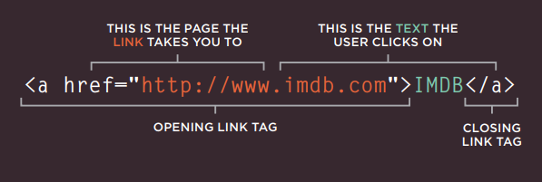

# Read: 04 - HTML Links, CSS Layout, JS Functions


## HTML Links
Links are created using the `<a>` element. Users can click on anything between the opening `<a>` tag and the closing `</a>` tag.
the <a> element which has an attribute called *href*. The value of the *href* attribute is the page that you want people to go to when they click on the link.



### Absolute URLs
URL used to link to different website you link (Linking to other sites).
```html
<p>Movie Reviews:
<ul>
<li><a href="http://www.empireonline.com">
Empire</a></li>
<li><a href="http://www.metacritic.com">
Metacritic</a></li>
<li><a href="http://www.rottentomatoes.com">
Rotten Tomatoes</a></li>
<li><a href="http://www.variety.com">
Variety</a></li>
</ul>
</p>
```

### relative URLs
URL used to link to other pages within the same site. They provide a shorthand way of telling the browser where to find your files
```html
<p>
    <ul>
        <li><a href="index.html">Home</a></li>
        <li><a href="about-us.html">About</a></li>
        <li><a href="movies.html">Movies</a></li>
        <li><a href="contact.html">Contact</a></li>
    </ul>
</p>
```

### Email Links
The value of the `href` attribute starts with `mailto:` and is followed by the email address you want the
 mail to be sent to ` <a href="mailto:jon@example.org">Email Jon</a>`
### Opening Links in A New Window
If you want a link to open in a new window use the target attribute and the value of it should be _blank.
` <a href="http://www.imdb.com" target="_blank"> Internet Movie Database</a>`

### Linking to A Specific Part of the Same Page
First you need to identify the points in the page that the link will go to. You do this using the id attribute, and to link to an element that uses an id attribute you use the `<a> ` element again, but the value of the `href `attribute starts with the `#`symbol, followed by the value of the id attribute of the element you want to link to.
```html
<h1 id="top">Film-Making Terms</h1>
<a href="#arc_shot">Arc Shot</a><br />
<a href="#interlude">Interlude</a><br />
<a href="#prologue">Prologue</a><br /><br />
<h2 id="arc_shot">Arc Shot</h2>
<p>A shot in which the subject is photographed by an encircling or moving camera</p>
<h2 id="interlude">Interlude</h2>
<p>A brief, intervening film scene or sequence, not specifically tied to the plot, that appears within a film</p>
<h2 id="prologue">Prologue</h2>
<p>A speech, preface, introduction, or brief scene preceding the the main action or plot of a film; contrast to epilogue</p>
<p><a href="#top">Top</a></p>
```
### Linking to A Specific Part of another Page
The `href` attribute will contain the address for the page (either an absolute URL or a relative URL), followed by the `#`  symbol, followed by the value of the id attribute that is used on the element you are linking to.
`<a href="http:/www.htmlandcssbookcom/ #bottom"> `

## Building Blocks
CSS treats each HTML element as if it is in its own box. This box will either be a block-level box or an inline box.

Block-level boxes start on a new line and act as the main building blocks of any layout, while inline boxes flow between surrounding text.
It is common to group a number of elements together inside a `<div>` elements, The `<div>` element that contains this group of elements is then referred to as the containing element.

CSS has the following positioning schemes that allow you to control the layout of a page: 
1. *normal flow*: Every block-level element appears on a new line, causing each item to appear lower down the page than the previous one.
2. *relative Positioning*: moves an element from the position it would be in normal flow, shifting it to the top, right, bottom, or left of where it would have been placed
3. *absolute Positioning*: positions the element in relation to its containing element.

***

Go back

[Back](README.md)

