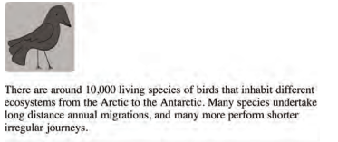
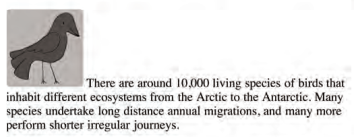
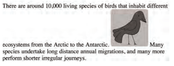

# Read: 05 - HTML Images; CSS Color & Text

## Images
***A picture can say a thousand words***
> ### Adding Images
* `` element is used to add images to a web page, and *src* attribute to indicate the source of an image and an *alt* attribute to describe the content of an image. 
* Photographs are best saved as JPEGs; illustrations or logos that use flat colors are better saved as GIFs

```html

```

#### Where to place Images in Your Code
1.  before a paragraph
```html

<p>There are around 10,000 living species of birds that inhabit different ecosystems from the Arctic to the Antarctic. Many species undertake long distance annual migrations, and many more perform shorter irregular journeys.</p>
```



2. Inside the start of a paragraph
```html
<p>There are around 10,000 living species of birds that inhabit different ecosystems from the Arctic to the Antarctic. Many species undertake long distance annual migrations, and many more perform shorter irregular journeys.</p>
```



3. In the middle of a paragraph
```html
<p>There are around 10,000 living species of birds that inhabit different ecosystems from the Arctic to the Antarctic.Many species undertake long distance annual migrations, and many more perform shorter irregular journeys.</p>
```


### Rules for Creating Images
1. Save Images in the Right format.
2. Save Images at the Right Size.
3. use the Correct Resolution.

### Figure and Figure Caption
`<figure>` element to contain images and their caption so that the two are associated.
 `<figcaption>` element allow web page authors to add a caption to an image.

```html
<figure>
  
  <br />
  <figcaption>Sea otters hold hands when they sleep so they don't drift away from each other.</figcaption>
</figure>
```

## Color
Every color on a computer screen is created by mixing amounts of red, green, and blue. Color not only brings your site to life, but also helps convey the mood and evokes reactions. You can specify any color in CSS in one of these ways:
1. rgb values: `rgb(100,100,90)`
2. hex Codes: `#ee3e80`
3. Color names: `Cyan`
4. HSLA, HSL: `hsla(0,100%,100%,0.5)`

## Text
### Specifying TypefaceS
* font-family: The value of this property is the name of the typeface you want to use, You can specify a list of fonts separated by commas.
`font-family: Georgia, Times, serif;`

### Size of type
* font-size: The value of this property enables you to specify a size for the font. There are several ways to specify the size of a font. The most common are:Pixels, percentageS, and emS.

```css
body {
  font-family: Arial, Verdana, sans-serif;
  font-size: 12px;}
h1 {
  font-size: 200%;}
h2 {
  font-size: 1.3em;}
```

### bold: allows you to create bold text.
* *normal* This causes text to appear at a normal weight.
* *bold* This causes text to appear bold

### Italic: allows you tocreate italic text
* normal: This causes text to appear in a normal style (as opposed to italic or oblique).
* italic: This causes text to appear italic.
* oblique: This causes text to appear
oblique

### uppercaSe & loWercaSe
The text-transform property is used to change the case of text giving it one of the following values:
* uppercase: This causes the text to appear uppercase.
* lowercase: This causes the text to appear lowercase.
* capitalize: This causes the first letter of each word to appear capitalized

### underline & strike
The text-decoration property
allows you to specify the
following values:
* none: This removes any decoration already applied to the text.
* underline: This adds a line underneath the text.
* overline: This adds a line over the top of the text.
* line-through: This adds a line through words.
* blink: This animates the text to make it flash on and off.

***

Go back

[Back](README.md)

