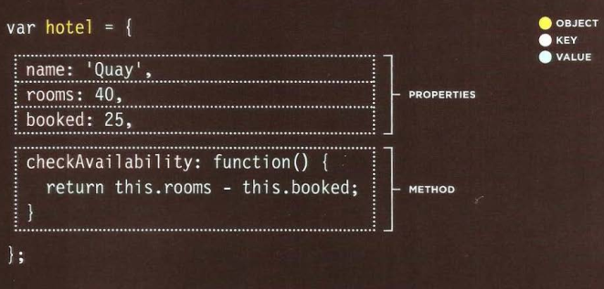
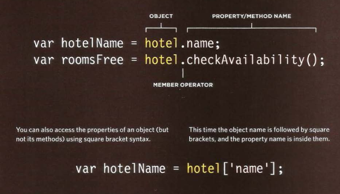

# Read: 06 - JS Object Literals; The DOM

## The Object
It is a group together a set of variables and functions to create a model of a something you would recognize from the real world. In an object, variables and functions take on new names

### Create an object



### Access an object


### CREATING·OBJECTS USING LITERAL NOTATION

```javascript
var hotel = {
  name: 'Quay',
  rooms : 40,
  booked : 25,
  checkAvailability: function() {
    return this.rooms - this.booked;
  }
} ;

var el Name = document .getElementByld('hotelName');
elName.textContent =hotel .name;

var elRooms = document.getElementByid{'rooms');
elRooms.textContent = hotel .checkAvailability();
```

## DOM
* The Document Object Model (DOM) specifies how browsers should create a model of an HTML page and how JavaScript can access and update the contents of a web page while it is in the browser window.
* The model is called a DOM tree, and it is stored in the browsers' memory. It consists of four main types of nodes Whenever a DOM query can return more than one node, it will always return a Nadeli st.
* From an element node, you can access and update its content using properties such as textContent and innerHTML or using DOM manipulation techniques.
* An element node can contain multiple text nodes and child elements that are siblings of each other.
* In older browsers, implementation of the DOM is inconsistent (and is a popular reason for using jQuery).
* Browsers offer tools for viewing the DOM tree

### ACCESSING ELEMENTS
DOM queries may return one element, or they may return a Nodelist, which is a collection of nodes.
* METHODS THAT RETURN A SINGLE ELEMENT NODE:
  1. `getElementByld( ' id ' )`
  2. `querySel ector( 'css selector ')`
* METHODS THAT RETURN ONE OR MORE ELEMENTS (AS A NODELIST):
  1. `getEl ementsByClassName( 'class ' )`
  2. `getEl ementsByTagName( ' tagName ' )`
  3. `querySelectorAll ( 'css selector ')`

### LOOPING THROUGH A NODELIST

```javascript
var hotlt ems = document .querySelectorAl l (' li.hot') ; 

  if (hot ltems.length > O) { 
    for (var i=O; i<hotl tems.length; i++) { 
    hotltems[i ] .className = 'cool'; 
    }
}
```
### TRAVERSING THE DOM
When you have an element node, you can select another element in relation to it using these five properties. This is known as traversing the DOM.

### WHITESPACE NODES
Traversing the DOM can be difficult because some browsers add a text node whenever they come across whitespace between elements.


***

Go back

[Back](README.md)

