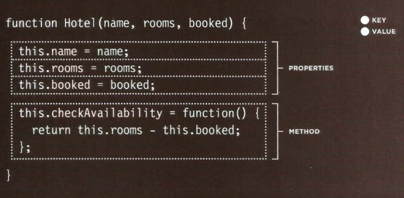

# Read: 07 - HTML Tables; JS Constructor Functions

## HTML Tables
There are several types of information that need to be displayed in a grid or table, table represents information in a grid format.

### basic Table structure
`<table>`
The `<table>` element is used to create a table. The contents of the table are written out row by row.
`<tr>`
You indicate the start of each row using the opening `<tr>` tag. It is followed by one or more `<td>` elements (one for each cell in that row). At the end of the row you use a closing `</tr>` tag.
`<td>`
Each cell of a table is represented using a `<td>` element. (The td stands for table data.)
`<th>`
The `<th>` element is used just like the `<td>` element but its purpose is to represent the heading for either a column or a row. 
`<thead>`
The headings of the table should sit inside the `<thead>` element.
`<tbody>`
The body should sit inside the `<tbody>` element.
`<tfoot>`
The footer belongs inside the `<tfoot`> element

```html
<table>
  <thead>
    <tr>
    <th>Date</th>
    <th>Income</th>
    <th>Expenditure</th>
    </tr>
  </thead>
  <tbody>
    <tr>
      <th>1st January</th>
      <td>250</td>
      <td>36</td>
    </tr>
    <tr>
      <th>2nd January</th>
      <td>285</td>
      <td>48</td>
    </tr>
    <tr>
      <th>31st January</th>
      <td>129</td>
      <td>64</td>
    </tr>
  </tbody>
  <tfoot>
    <tr>
      <td></td>
      <td>7824</td>
      <td>1241</td>
    </tr>
  </tfoot>
</table>
```

result
]

If you need the entries in a table to stretch across more than one column, The *colspan* attribute can be used on a `<th>` or `<td>` element and indicates how many columns that cell should run across. The *rowspan* attribute can be used on a `<th>` or `<td>` element to indicate how many rows a cell should span down the table

## JS Constructor
The ***new*** Keyword and the object constructor create a blank object.


### update an object 
```javascript
hotel.name = 'park';
hotel ['name'] = 'park';
```

### delete an object 
```javascript
hotel.name = '';
delete hotel.name;
```


***

Go back

[Back](README.md)

