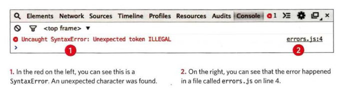
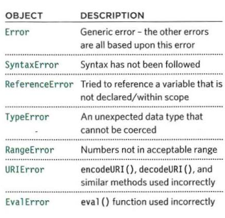
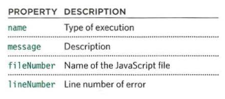

# Read: 10 - JS Debugging

* Debugging is the process of finding errors. It involves a process of deduction

* Each time a script enters a new execution context, there are two phases of activity: PREPARE & EXECUTE

* understand execution contexts and stacks, you are more likely to find the error in your code.

* The console helps narrow down the area in which the error is located, so you can try to find the exact error. 

* JavaScript has 7 different types of errors. 

Each error creates its own error object, which can tell you its line number and gives a description of the error. Error objects can help you find where your mistakes are and browsers have tools to help you read them. When an Er ror object is created, it will contain the following properties:

* If you know that you may get an error, you can handle it gracefully using the try, catch, finally statements. Use them to give your users helpful feedback.

***

Go back

[Back](README.md)

