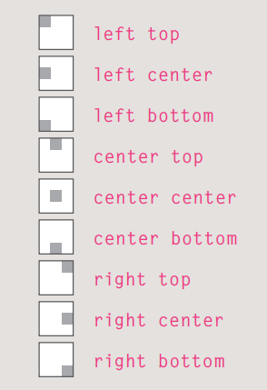

# [Read: 11 - Assorted Topics

# Images

## BackgroUnd Images

```css
background-image: url("images/pattern.gif");}
```

* `background-repeat`: property can have four values:
1. repeat
The background image is repeated both horizontally and
vertically (the default way it is shown if the backgroundrepeat property isn't used).
2. repeat-x
The image is repeated horizontally only (as shown in the first example on the left).
3. repeat-y
The image is repeated vertically only.
4. no-repeat
The image is only shown once

* `background-attachment`: property specifies whether a background image should stay in one position or move as the user scrolls up and down the page. can have one of two values:
1. fixed
2. scroll

* `background-position`: property to specify where in the browser window the background image should be placed.



***
## Practical information

* Search engine optimization helps visitors find your sites when using search engines.
* Analytics tools such as Google Analytics allow you to see how many people visit your site, how they find it, and what they do when they get there.
* To put your site on the web, you will need to obtain a domain name and web hosting.
* FTP programs allow you to transfer files from your local computer to your web server.
* Many companies provide platforms for blogging, email newsletters, e-commerce and other popular website tools (to save you writing them from scratch).


***

Go back

[Back](README.md)

