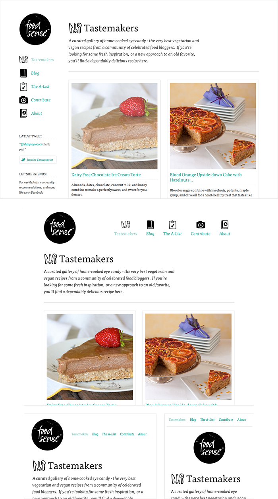

# Read: 01 - SMACSS and Responsive Web Design

## What is the Responsive Web Design?

- practice of building a website suitable to work on every device and every screen size, no matter how large or small, mobile or desktop.
- most popular technique lies within responsive web design, favoring design that dynamically adapts to different browser and device viewports, changing layout and content along the way. This solution
- benefits of being all three, responsive, adaptive, and mobile.




- Responsive web design is broken into three main components:

  1. flexible layouts: the practice of building the layout of a website with a flexible grid, capable of dynamically resizing to any width. Flexible grids are built using relative length units, most commonly percentages or em units. These relative lengths are then used to declare common grid property values such as width, margin, or padding.
  2. media queries: provide the ability to specify different styles for individual browser and device circumstances, the width of the viewport or device orientation for example.

  ```html
  <link
    href="styles.css"
    rel="stylesheet"
    media="all and (max-width: 1024px)"
  />
  ```

3. flexible media: as viewports begin to change size media doesn’t always follow suit. Images, videos, and other media types need to be scalable, changing their size as the size of the viewport changes.

## What is “Float”?

- CSS positioning property.
- Aside from the simple example of wrapping text around images, floats can be used to create entire web layouts.
- Floats are also helpful for layout in smaller instances.
