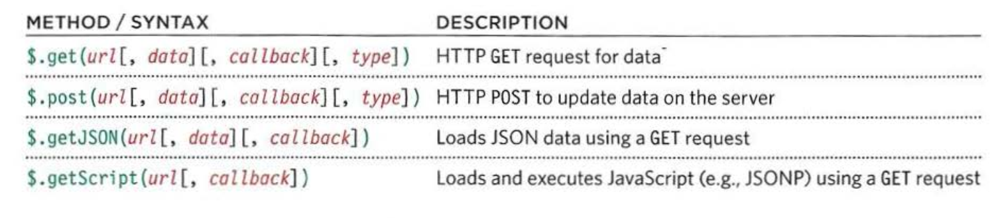

# Read: 02 - jQuery, Events, and The DOM

* jQuery is a js file that we include in our web pages.

* jQuery offers a simple way to achieve a variety of common JavaScript tasks quickly and consistently, across all major browsers.

* jQuery makes it easier to handle events because the event methods work across all browsers.

* jQuery makes coding simpler because:
  1. SIMPLE SELECTORS
  2. COMMON TASKS IN LESS CODE
  
* **write less, do more**: jQuery it allows you to achieve the same goals but in fewer lines of code than you would need to write with plain JavaScript.

* In order to use jQuery:
  1. first include the jQuery script in your page. included it before the closing `</body>` tag.
  2. Once jQuery has been added to the page, a second JavaScript file is included that uses jQuery selectors and methods to update the content of the HTML page.

* Inserting new elements involves two steps:
  1. Create the new elements in a jQuery object`var $newltem = $('<li class="new">item</ li>');`
  2. Use a method to insert the content into the page

* The `•htm1()` and `•text()` methods both retrieve and update the content of elements.

* `.remove()`:This method removes all of the elements in the matched set.

* `replaceWith()`: This method replaces every element in a matched set with new content. It also returns the replaced elements.

* jQuery provides four shorthand methods to handle specific types of Ajax requests.
.
